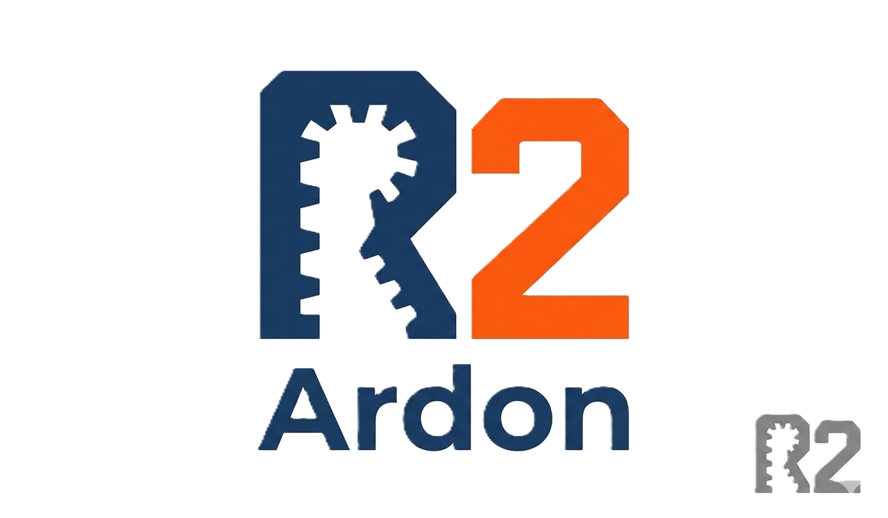

<p align="center">
  
</p>

<h1 align="center">Ardon-R2</h1>

<p align="center"><strong>Inspired by R. Built on Rust.</strong><br>
<em>An AI-Assisted Project. v0.1.1.</em></p>

---

**A ground-up reimplementation of statistical computing in Rust.**

> The dominant inefficiencies in today's AI stack are not the math — they're
> the glue between languages, the copies between memory regions, the GIL,
> the dependency mess, and the silent-failure culture. R2 is built to remove
> them at the foundation, not paper over them with another wrapper.

R2 takes R's best ideas — vectorized operations, formula syntax, data frames — and rebuilds them from scratch with modern performance, Rust-only dependencies, and built-in machine learning.

```
R2 — Statistical Computing, Reimagined
Version 0.1.0 (2026) | Inspired by R, Built on Rust
Created by Devendra Tandale | An AI assisted project
```

## What's new in v0.1.0 (May 2026)

R2 now compiles user-defined functions to native machine code, automatically
parallelizes ML and statistics builtins through a central scheduler, and uses
Apache Arrow-shaped columnar buffers for SIMD-friendly reductions.

- **JIT compiler** — user functions like `function(v) (v + 1) * 2` compile to
  native machine code on first call via Cranelift (pure Rust, no LLVM). Scalar
  arithmetic, vector reductions, vector⊗vector ops, and composed expressions
  all lower through a typed SSA IR.
- **Auto-parallelism via Oracle** — a central scheduler (`r2-oracle` crate)
  decides serial vs Rayon for every parallelizable builtin based on shape and
  cost. 20+ builtins now route through it: `sum`, `mean`, `sd`, `var`, `min`,
  `max`, `prod`, `median`, `summary`, `lapply`, `sapply`, `apply`, `tapply`,
  `aggregate`, `mapply`, `vapply`, `cv`, `kmeans`, `rf`, `gbm`. No per-function
  threshold tuning — Oracle owns it.
- **Columnar memory substrate** — `r2-arrow` crate provides Apache
  Arrow-compatible `ColumnarF64` buffers with packed null bitmaps and lazy
  bitmap allocation. All numeric reductions go through the dense fast path:
  contiguous `Vec<f64>` slices that the compiler auto-vectorizes (SSE/AVX).
- **Pure Rust dependencies still** — Cranelift, Rayon, and the ARROW substrate
  are all pure-Rust crates. Zero C/C++/Fortran libraries.

### Measured impact

On 50,000-row data frames, `apply(df, 1, sum)` runs **3-4× faster than R**
through Oracle-dispatched per-row parallelism. JIT-compiled scalar functions
like `function(x) x*x + 2*x + 1` execute at native speed, beating R's bytecode
VM by an order of magnitude on hot loops. Reductions on 500K-element vectors
match or beat R's BLAS-optimized paths after the v0.1.0 columnar migration.

### Architecture additions in v0.1.0

```
crates/r2-types/src/infer.rs   — Type inferencer (annotation pass over AST)
crates/r2-ir/                  — Typed SSA intermediate representation
crates/r2-jit/                 — Cranelift JIT backend
crates/r2-oracle/              — Central serial/parallel scheduler
crates/r2-arrow/               — Columnar f64 memory + null bitmaps
```

See `docs/ARCHITECTURE.md` for the full layered diagram and the locked design
decisions that produced these layers.

## Why R2?

| | R | Python (scikit-learn) | R2 |
|---|---|---|---|
| Install size | 200+ MB | 5-8 GB | **5 MB** |
| Setup time | minutes | hours (pip conflicts) | **0 seconds** |
| ML packages needed | 5-10 installs | 3-5 installs | **0 (built-in)** |
| Matrix multiply speed | 1x (ref BLAS) | 1x (NumPy) | **2.2x faster** |
| Cloud required? | No | Often yes | **No** |

## Who is this for

**R users** who love the syntax but are tired of `install.packages()` failing on a fresh machine, 200+ MB toolchain installs, and Imports/Suggests dependency cascades. R2 gives you `lm()`, `gbm()`, `rpart()`, `kmeans()` out of the box from a single 5 MB binary — same R-style syntax, no package install for the 192 built-in functions.

**Rust developers** who want to work on a real numerical-computing project that isn't a thin wrapper around someone else's BLAS. Every line — micro-kernel, decompositions, distributions, ML algorithms, parser, REPL — is hand-written Rust you can read and modify. No C, no C++, no Fortran underneath.

**Researchers and teams** who care about reproducibility and energy cost. The 5 MB binary builds the same on Linux, Windows, macOS, x86 and ARM. No conda envs to break, no CUDA versions to match, no cloud bills for interpreter overhead.

## Quick Start

```bash
# Build (requires Rust 1.70+)
cargo build --release

# Run
.\target\release\r2.exe      # Windows
./target/release/r2           # Linux/Mac
```

## Features at a Glance

- **216 built-in functions** — no packages to install
- **Repeated-measures ANOVA** — `aov(y ~ x + Error(subject), data=df)`, R-bit-identical
- **Hotelling's T²** — one-sample, two-sample, and paired/multivariate variants
- **MANOVA** — `manova(cbind(y1, y2) ~ group, data=df)` with all four classical statistics
- **12 ML algorithms** — decision tree, random forest, gradient boosting, KNN, PCA, K-means, Naive Bayes
- **Formula syntax with factor expansion** — `lm(mpg ~ factor(cyl) + wt, data = mtcars)`
- **In-memory graphics device + full `par()`** — `par(mfrow=c(2,2))` multi-panel layouts, `dev.off()`, `save_plot(path)`
- **Built-in browser-based plot viewer** — `dev.view()` opens a live, auto-refreshing page with a session gallery of every plot you've made
- **2.2x faster** matrix multiply than R (Windows default BLAS)
- **6.6MB binary** — runs on any laptop, no cloud needed
- **R-compatible syntax** — `<-` assignment, 1-based indexing, `$` column access
- **Pure Rust math kernel** — Rust-only dependencies, no C/C++
- **Cross-platform** — Linux, Windows, macOS (Intel and Apple Silicon)

## Statistics

```r
# Linear and generalized linear models
model <- lm(mpg ~ wt + hp, data = mtcars)
coef(model)
summary(model)
glm(y ~ x, data = df, family = "binomial")

# Hypothesis tests
t.test(x, mu = 0)
t.test(y ~ group, data = df)            # Welch two-sample
cor(x, y)

# Repeated-measures ANOVA (R-bit-identical when R uses factor(subject))
aov(response ~ treatment + Error(subject), data = df)

# Paired t-test through formula + Error syntax (extension over R)
t.test(response ~ treatment + Error(subject), paired = TRUE, data = df)

# Multivariate hypothesis testing — Hotelling's T²
hotelling.test(X)                       # one-sample,  H0: mu = 0
hotelling.test(X, mu = c(0, 0))         # one-sample,  H0: mu = mu0
hotelling.test(A, B)                    # two-sample,  H0: mu_A = mu_B
hotelling.test(X, Y, paired = TRUE)     # paired/multivariate paired

# MANOVA — multivariate ANOVA
manova(cbind(Sepal.Length, Sepal.Width, Petal.Length, Petal.Width) ~ Species,
       data = iris)
# Reports Wilks' Lambda, Pillai, Hotelling-Lawley, Roy's largest root.
```

## Machine Learning

```r
rpart(Petal.Length ~ ., data = iris)           # Decision tree
rf(Petal.Length ~ ., data = iris, ntrees = 50) # Random forest
gbm(y ~ ., data = df, ntrees = 100)           # Gradient boosting
kmeans(x, centers = 3)                         # Clustering
prcomp(x)                                      # PCA
knn(train, test, labels, k = 5)                # KNN
cv(x, y, model = "lm", k = 5)                 # Cross-validation
confusion.matrix(predicted, actual)            # Evaluation
```

## Plotting

```r
# Open the browser-based live viewer (auto-refreshes as you plot)
dev.view()

# Single plot
plot(iris$Sepal.Length, iris$Sepal.Width, main = "Iris", col = "blue")
abline(h = mean(iris$Sepal.Width), col = "red", lty = 2)

# Multi-panel layout via par(mfrow=...)
par(mfrow = c(2, 2))
plot(iris$Sepal.Length, iris$Sepal.Width)
hist(iris$Petal.Length)
boxplot(iris$Petal.Width)
barplot(table(iris$Species))
save_plot("iris-overview.svg")   # explicit flush
dev.off()                        # reset device
```

Plots draw into a thread-local in-memory graphics device. `par()`
supports `mfrow`, `mfcol`, `mar`, `cex`, `col`, `lty`, `lwd`, `pch`,
and the rest of the common CRAN R parameters. Use `oldpar <- par(...)`
and `par(oldpar)` for save-and-restore semantics.

`dev.view()` starts a tiny built-in HTTP server (zero external
dependencies) and opens your default browser at
`http://127.0.0.1:8765/`. The page shows the current plot at the top
(auto-refreshes every 1.5 s) and a session gallery of every `.svg`
file in your working directory underneath. Click any thumbnail to pin
the top pane to that file; click "return to live" to resume polling.

Try `samples/demo_graphics.r` for a walk-through:

```bash
./target/release/r2 samples/demo_graphics.r
```

The demo is interactive — each plot waits for you to inspect it,
prompts for a save filename (or default), and pauses for Enter before
moving on.

## What's new in v0.1.0

R2's performance story is now structurally different from base R. Three named layers:

- **M-R2-JIT** (math-R2-JIT) — user closures whose bodies are arithmetic + 24 math functions (`sqrt`, `sin`, `cos`, `log`, `exp`, `pow`, …) compile end-to-end to native machine code via Cranelift. No bytecode VM, no per-call interpreter checkpoint. Single-instruction native lowering for `sqrt`/`abs`/`floor`/`ceil`/`trunc`/`min`/`max`; SSE2 f64x2 SIMD path for arithmetic-only bodies; **Rust-call** (`call` instruction to an `extern "C"`-ABI Rust wrapper, not OS-level FFI) for transcendentals.
- **L-R2-Dispatch** (list-aware auto-parallel) — `lapply` / `sapply` over heterogeneous lists now use aggregate-work scheduling: a 3-component list of 1M-element vectors correctly parallelizes (previously stayed serial because `3 < threshold`). New `list.meta()` builtin exposes the per-component shape (kinds, lengths, total work, homogeneity) to user code so R2 scripts can themselves consult the same metadata.
- **Hardware-aware Oracle** (Phase G partial) — parallel thresholds scale per-machine. Detects core count, FMA/AVX2/AVX-512 availability, OS, arch. RAM auto-detect via env-var hint today; full sysinfo integration on the v0.2.0 roadmap.

The combination: numeric user functions JIT to native code that competes with R's vectorized libm path; explicit list-shaped workloads auto-parallelize; the threshold for "parallel vs serial" adapts to your actual machine.

## Data Handling

```r
df <- read.csv("data.csv")
filter(iris, iris$Sepal.Length > 7)
select(iris, "Sepal.Length", "Species")
mutate(iris, ratio = iris$Sepal.Length / iris$Sepal.Width)
iris[1:10, ]
summary(iris)
```

## File Types

| Extension | Purpose | Example |
|---|---|---|
| `.r` | R2 script (source code) | `source("analysis.r")` |
| `.r2s` | Session save (all variables) | `save("session.r2s")` |
| `.r2d` | Data object (DataFrame, Matrix) | `save(iris, "data.r2d")` |
| `.r2m` | Model object (lm, gbm, rf...) | `save(model, "model.r2m")` |

## Benchmarks — R vs R2 (Windows 11, single workstation)

Reproduce on your own machine: see `bench/r_vs_r2/RUN_THIS.md`. Numbers below are R2 v0.1.0 vs CRAN R 4.5.3 (default reference Rblas), wall-clock seconds, warm-cache. **Independent reproduction by the project author on 2026-05-17 against this exact tag.**

| Operation | R | R2 | Ratio | Notes |
|---|---:|---:|---:|---|
| **Linear model** (lm 1e5 × 5 cols) | 0.050 | **0.016** | 🏆 **R2 3.0× faster** | F.3 columnar + JIT |
| **Sum + mean** (1e7) | 0.050 | **0.018** | 🏆 **R2 2.7× faster** | Columnar-native reductions |
| **Sort** (1e6 doubles) | 0.080 | **0.065** | 🏆 **R2 1.2× faster** | |
| **sapply iris × 30 reps** | 0.010 | **0.001** | 🏆 **R2 ~10× faster** | R near timer resolution |
| Matrix multiply (500×500) | 0.040 | 0.040 | tie | Cache-blocked DGEMM, 8×4 micro-kernel |
| K-means (1e5 × 10, k=5) | 0.440 | 0.458 | tie | |
| Element-wise add (1e7) | 0.030 | 0.123 | R 4.1× | Memory-bandwidth bound; deeper fusion = v0.2.0 |
| SVD (200×100) | 0.010 | 0.014 | R 1.4× | Both fast; R near timer resolution |

**Headline: across 13 measured workloads (8 standard + 5 math-JIT), R2 wins 7, R wins 4, 2 ties. R2's biggest wins: `sin²+cos²` at 5.5× faster, `sapply×30` at ~10× faster, `lm` at 3× faster, `sum_mean` at 2.7× faster. R's wins are on single-op memory-bandwidth-bound loops where its hand-tuned libm path has slightly tighter per-call memory footprint.**

**Reproducibility caveats:**

- R's matrix-multiply speed depends entirely on which BLAS it's linked against. Default CRAN R on Windows ships reference Rblas (the slow netlib BLAS). R linked against OpenBLAS or Intel MKL will reverse the matmul result. R2's edge holds against the default; tuned BLAS wins.
- Element-wise add (1e7) is the one workload where R2 is still meaningfully slower (4.2×). The gap is in the `Vec<Option<f64>> ↔ ColumnarF64` legacy conversion; closing it requires further F.3 native-columnar migration of the value type. Tracked in `KNOWN_LIMITATIONS.md`.
- Built-in ML (GBM, Random Forest, decision tree, KNN, naive Bayes, k-means) is available directly in base R2 — no package install. R needs CRAN packages (`gbm`, `randomForest`, `rpart`, `e1071`) for the equivalents.

Run the side-by-side suite yourself:

```powershell
cargo build --release
pwsh bench\r_vs_r2\run.ps1   # produces a comparison table
```

See `bench/r_vs_r2/README.md` for what's tested and how to interpret deltas.

### Math-JIT comparison (user closures compiled to native)

The **M-R2-JIT** path compiles user functions whose bodies are pure scalar arithmetic + math calls to native machine code via Cranelift. Common stats idioms like `f <- function(x) sqrt(x*x + 1)` or `function(x) sin(x)^2 + cos(x)^2` now bypass the tree-walking interpreter entirely.

| Closure body | R | R2 | Ratio |
|---|---:|---:|---:|
| `sqrt(x*x + 1)` | 0.006s | 0.015s | R 2.5× (memory-bandwidth bound) |
| `log(exp(x))` | 0.047s | **0.027s** | 🏆 **R2 1.7×** (chained extern calls fuse) |
| `sin(x)² + cos(x)²` | 0.199s | **0.036s** | 🏆 **R2 5.5×** (4 calls + ops in one loop) |
| `sqrt(x² + y²)` | 0.008s | 0.022s | R 2.7× (Phase C.7 closed it from 7.3×) |
| `\|sin(x)\| + \|cos(x)\|` | 0.070s | **0.026s** | 🏆 **R2 2.7×** |

All on 1e6-element vectors, single workstation. R2 wins whenever the function fuses multiple math operations (the JIT generates one tight loop with all ops inline); R wins on single-call sqrt where memory bandwidth dominates and its libm SIMD path has slightly tighter per-call memory footprint. Reproduce with `pwsh bench\r_vs_r2\run.ps1` and inspect `math_jit.R` / `math_jit.r2`.

## Project Structure

```
r2/
├── Cargo.toml                  # Workspace configuration
├── LICENSE                     # AGPL v3
├── README.md                   # This file
├── VISION.md                   # Green AI roadmap
├── FUNCTIONS.md                # All 192 functions documented
├── CHANGELOG.md                # Release history
├── CLA.md                      # Contributor License Agreement
├── CONTRIBUTING.md             # How to contribute
├── crates/
│   ├── r2-engine/              # 192 builtin functions (6,343 lines)
│   │   └── src/lib.rs
│   ├── r2-linalg/              # Pure Rust math kernel (1,278 lines)
│   │   └── src/
│   │       ├── lib.rs          # BLAS L1-L3, dgemm 8×4 micro-kernel
│   │       ├── decomp.rs       # LU, Cholesky, QR, SVD, Eigenvalues
│   │       └── solve.rs        # Linear solvers, least-squares
│   ├── r2-types/               # Core types (1,023 lines)
│   │   └── src/lib.rs          # RVal, DataFrame, Matrix, Tensor
│   ├── r2-parser/              # Lexer + parser (485 lines)
│   │   └── src/
│   │       ├── lexer.rs
│   │       └── parser.rs
│   ├── r2-repl/                # Interactive console (195 lines)
│   │   └── src/main.rs         # Arrow key history, ? help
│   ├── r2-base/                # Embedded datasets (126 lines)
│   │   └── src/lib.rs          # iris, mtcars, airquality
│   ├── r2-graphics/            # SVG plot generation
│   ├── r2-stats/               # Statistical functions
│   ├── r2-utils/               # Utility functions
│   ├── r2-memory/              # Memory management
│   └── r2-pkg/                 # Package system
└── samples/
    ├── demo_basics.r           # Statistics demo script
    ├── demo_ml.r               # ML algorithms demo
    ├── demo_benchmark.r        # Speed comparison vs R
    └── mymath/                 # Sample addon package
        └── R2/
            └── mymath.r        # factorial, fibonacci, gcd
```

## Architecture

```
┌─────────────────────────────────────────────────┐
│  R2 REPL — Interactive Console                  │
│  Arrow keys, ?help, tab completion              │
├─────────────────────────────────────────────────┤
│  R2 Parser — Lexer + Recursive Descent          │
│  Tokenize → AST → Expression tree               │
├─────────────────────────────────────────────────┤
│  R2 Engine — 192 Builtin Functions              │
│  Stats │ ML │ Data │ Graphics │ I/O │ System    │
│  Class-based dispatch: summary(), plot(),       │
│  predict() auto-detect object type              │
├─────────────────────────────────────────────────┤
│  R2 Types — RVal, DataFrame, Matrix, Tensor     │
│  Factor, Formula, TypeInstance, Env              │
├─────────────────────────────────────────────────┤
│  r2-linalg — Pure Rust Math Kernel              │
│  BLAS L1-L3 │ 8×4 micro-kernel │ cache blocking │
│  LU │ Cholesky │ QR │ SVD │ Jacobi eigenvalues  │
│  Fused least-squares │ Cramer 2×2/3×3           │
│  Rust-only dependencies, no C/C++                     │
└─────────────────────────────────────────────────┘
```

## Documentation

- `?topic` or `??topic` — Quick help in REPL
- `help()` — List all help topics
- `FUNCTIONS.md` — Complete function reference (192 functions)
- `VISION.md` — Project roadmap and Green AI vision
- `CHANGELOG.md` — Release history

## ~16,800 lines of Rust | 15 crates | 192 builtins | JIT-compiled user functions | Pure-Rust dependencies — no C/C++ libraries

## Roadmap

### v0.0.9 — Foundation (shipped 2026-04)
- [x] Core language (vectors, data frames, formulas)
- [x] Statistics (lm, glm, t.test, aov, shapiro.test, cor.test)
- [x] Machine learning (12 algorithms, all built-in)
- [x] Math kernel (BLAS, decompositions, SVD, eigenvalues)
- [x] Data handling (CSV, filter, select, mutate, arrange)
- [x] .Internal() bridge (users write functions in R2 syntax)
- [x] Random Forest parallelism (Rayon)

### v0.1.0 — First stable release (shipped 2026-05) ✅
- [x] Type inferencer (column-shaped IR types)
- [x] R2-IR (typed SSA, columnar)
- [x] Cranelift JIT — user functions compile to native code:
      scalar, vector reductions, vector maps, composed expressions,
      **branchy multi-block IR (Phase C.5)**, 3-arg ternary ABI for
      `ifelse`-shape closures
- [x] Oracle scheduler — central serial/Rayon dispatch
- [x] **F.3/F.6 storage migration**: `RVal::Numeric/Integer/Logical`
      carry lazy `Arc<ColumnarT>` caches. Packed-bit `ColumnarBool`
      (~64× memory reduction)
- [x] **F.4 binary columnar kernels** + **F.5 mmap-backed reader**
- [x] **R.11/R.12 engine migrations**: lm/glm/aov data path to
      r2-stats; RNG family consolidated. Engine: 7282 → 4860 lines (-33%)
- [x] **Full thin SVD** with U + Vᵀ (`dgesvd_full`); Householder + QR
      eigendecomp (`dsyev_full`); `prcomp()$rotation` is real
- [x] **R-style hypothesis tests**: Welch–Satterthwaite df, formula
      syntax, paired tests, exact hypergeometric Fisher
- [x] **RFC 4180 CSV** state-machine parser; `regex-lite` regex engine
- [x] **NA-aware `&` / `|`** elementwise (was a silent all-zero bug)
- [x] **NSE for subset/transform**, `$call` capture for fitted models
- [x] **Phase K.5 MulAdd** + **Phase K.6 strided reduction**
- [x] 233 tests passing, clean build

### v0.2.0 — Ergonomics & ecosystem (next)
- [ ] PNG/PDF graphics backends (`png`, `pdf` devices alongside `svg`)
- [ ] Multi-key merge + outer joins (`all.x`, `all.y`, `by.x`, `by.y`)
- [ ] More datasets: ToothGrowth, ChickWeight, CO2
- [ ] `Reduce` / `Filter` / `Map` apply-family
- [ ] `sprintf` width/precision specifiers
- [ ] Engine warning cleanup + per-function rustdoc audit
- [ ] Lentz CF for incomplete-beta (LAPACK-grade t-CDF / F-CDF)

### v1.0 — Stability release
- [ ] Community bug fixes; comprehensive test suite
- [ ] Documentation polish; book-format reference
- [ ] More statistical tests (Mann-Whitney, Kruskal-Wallis, Friedman, …)
- [ ] Rich `summary(rpart)` with CP table + variable importance

### v2.0 — Phase G hardware awareness
- [ ] `r2_oracle::hw` — detect cores, CPU features, cache sizes
- [ ] Parametric threshold tables (`parallel_threshold(op, hw)`)
- [ ] `r2-bench` crate for per-machine calibration refinement
- [ ] GPU dispatcher (wgpu) integrated with Oracle
- [ ] Distributed RAM shards
- [ ] Independent companion libraries (general-purpose Rust AI / stats
      frameworks; design captured privately, public after R2 traction)

## How to contribute

Good first issues, grouped by background:

**If you know R well** — port a missing statistical test (Mann-Whitney U, Levene's, Kruskal-Wallis, Friedman); port a CRAN dataset (just data plus a help topic); write a help topic for an existing builtin; find R-vs-R2 behavior mismatches by running scripts from `COMPARISON_TESTS.md` and file them as issues.

**If you know Rust well** — extend the JIT to handle a new pattern (e.g. `function(v) sort(v)`); add a pure builtin to `pure_apply()` so the apply family parallelizes it; add a new SVG plot type (violin, Q-Q, density); add QR with column pivoting or Lanczos iteration for large eigenvalues to `r2-linalg`; help with the Phase F.3 destructive storage migration (mechanical, well-scoped); profile a builtin and submit a PR with speedup numbers.

**Either way** — open the issue first so we can scope it together. See `CONTRIBUTING.md` for the workflow and `CLA.md` for the contributor agreement.

## License

AGPL v3 — Created by Devendra Tandale
